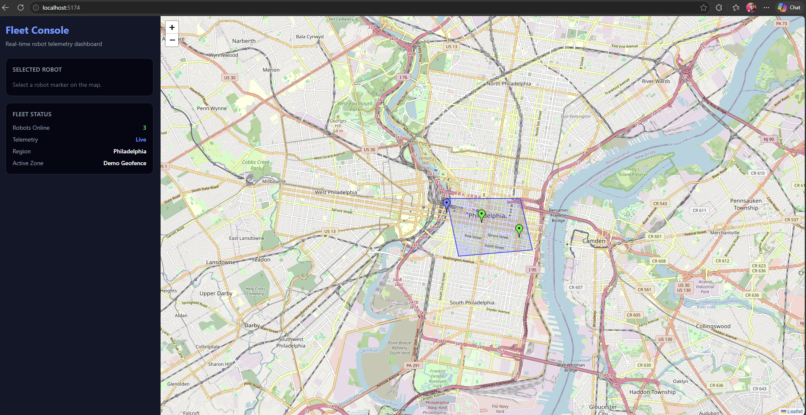
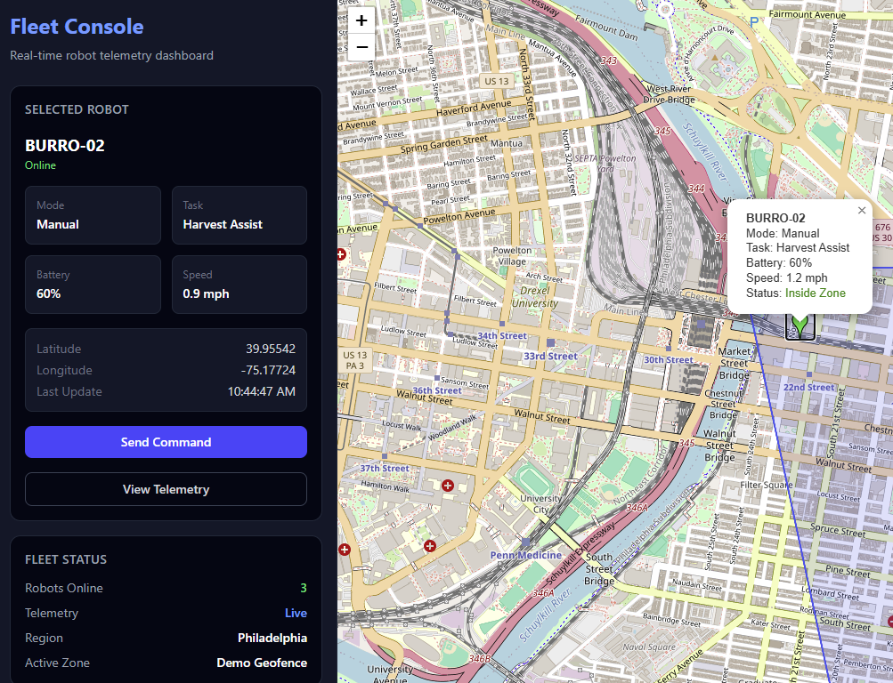
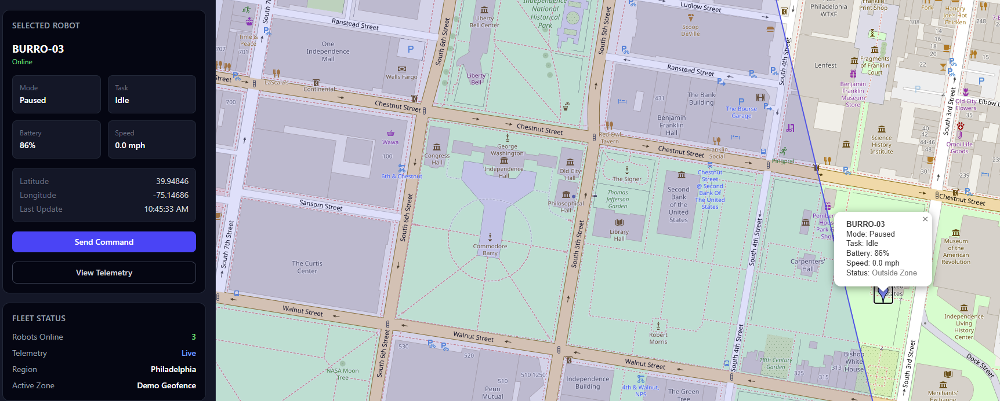

# Fleet Console (Burro-style Prototype)

Real-time fleet management interface for autonomous outdoor robots.

## Overview
This project simulates a map-based control system for managing a fleet of autonomous robots operating in outdoor environments.

It demonstrates how high-frequency telemetry, spatial constraints, and operator workflows can be combined into a single interface.

## Features

- Real-time robot telemetry simulation (position, speed, battery)
- Interactive map visualization using Leaflet
- Multi-agent system with independent robot states
- Robot selection and operator control panel
- Geofence zone rendering
- Spatial awareness: robots dynamically identified as inside/outside zones
- Live UI updates based on system state

## Tech Stack

- React + TypeScript
- Vite
- Leaflet (map rendering)
- TailwindCSS (UI)
- Custom geospatial logic (point-in-polygon)

## Why this matters

This project models real-world problems in robotics and fleet management systems:

- Visualizing high-frequency telemetry
- Managing multiple autonomous agents
- Enforcing spatial constraints (geofencing)
- Providing operator decision support

## Screenshots

### Fleet Overview

### Robot Selected

### Zone Awareness

## Future Improvements

- Path routing / waypoint navigation
- Backend API + React Query integration
- Persistent geofence storage
- Multi-user operator view
